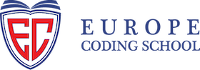

# Europe Coding School

**CPD-Accredited Technology Education · Istanbul · Amsterdam · Tallinn**

*Turning ideas into products — with a focus on **Data Science** & **Artificial Intelligence***

---

## 🚀 Programlarımız

Eğitim materyallerimiz, örnek projelerimiz ve ders içeriklerimiz bu organizasyon altında açık şekilde paylaşılır.

### 🤖 Öne Çıkanlar

| Program | İçerik | Repo |
|---|---|---|
| 📊 **Data Science** | Python, Pandas, ML notebook'ları, gerçek veri projeleri | [`data-science`](https://github.com/europecodingschool/data-science) |
| 🧠 **Artificial Intelligence** | LLM'ler, RAG, fine-tuning, AI ile Fikirden Ürüne | [`artificial-intelligence`](https://github.com/europecodingschool/artificial-intelligence) |

### 📚 Diğer Programlar

| Program | Repo |
|---|---|
| 💻 Full Stack Development | [`fullstack-development`](https://github.com/europecodingschool/fullstack-development) |
| 🏢 SAP ERP | [`sap-erp`](https://github.com/europecodingschool/sap-erp) |
| 🔐 Cybersecurity | [`cybersecurity`](https://github.com/europecodingschool/cybersecurity) |

---

## 🛠️ Kullandığımız Teknolojiler

---

## 🎯 Misyonumuz

Öğrencilerimizi yalnızca kod yazmayı bilen değil, **fikri ürüne dönüştürebilen** teknoloji profesyonelleri olarak yetiştiriyoruz. Kurumsal iş ortaklarımız arasında Türkiye'nin önde gelen şirketleri yer alıyor.

**[🌐 Website](https://europecodingschool.com) · [💼 LinkedIn](https://linkedin.com/company/europecodingschool) · [📧 İletişim](https://europecodingschool.com)**

